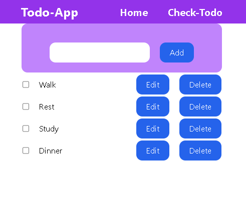
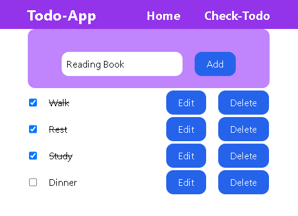

# Todo-App 

A Simple Basic Todo Webpage   Built with  React.js
and Tailwindcss that is basically a Todo App  its Note Your Daily Task and Target.

## Features

- Note Your Daily Task
- After Done You Can Checkout
- Responsive 
- Edit Your Task 
- Delete Completed Task

## Screenshots

###

## Getting Started

 Follow these instructions to get a copy of the project up and running on your local machine.

### Prerequisites

 - Node.js
 - React.js

 - All These Application Must Be Installed in your System 

 ### Installing
 1. Clone the repository:

 git clone https://github.com/ssdevloper/Todo_App.git

 ### Run Command
cd Todo_App

npm install 

npm run dev
 

### Author

Shubham Singh